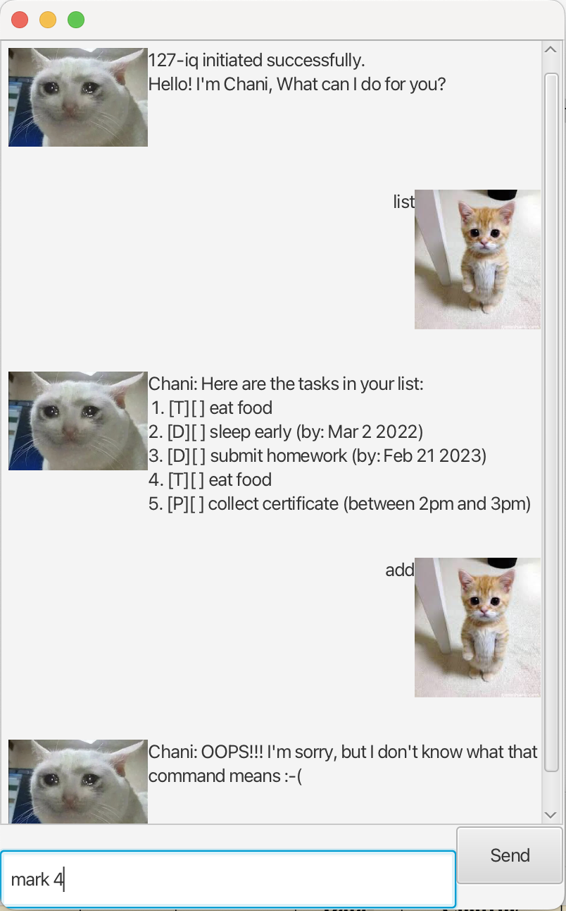

# ChaniBot User Guide



Chani is your sad chatbot to help you manage tasks efficiently. Do not abuse it too much.
It can add, list, mark as done, and delete tasks, all through a simple chat interface.

## Features
- Commands are **case-sensitive**.
- Always use the **task number** from the latest `list` output when marking done, unmarking, or deleting.
- If a command fails (e.g., invalid number, wrong date format), Chani will display an error message.
- Tasks are only saved when exiting using `bye`.
- only Deadlines tasks require specific date/time formats (Chani will validate your input).


## Listing Tasks

View all tasks in your list.

**Command:** `list`

**Example:** 
`list`

**Expected Output**:
```
Chani: Here are the tasks in your list:    
1. [T][] Eat Food
2. [D][] finish survey (by: Mar 2 2022)
3. [D][] submit homework (by: Feb 21 2023)

```

---

## Exiting Chani

Save your tasks and exit the chatbot.

**Command:** `bye`

**Example:** 
`bye`

**Expected Output**:
```
Chani: See you again soon :( 
Saving and closing bot...    
```

---

## Marking Tasks as Done

Mark a task as completed.

**Command:** `mark <task number>`

**Example:**  
`mark 1`

**Expected Output**:
```
Chani: Nice! I've marked this task as done:
 [T][X] Eat food    
```

---

## Unmarking Tasks

Mark a previously done task as not done.

**Command:** `unmark <task number>`

**Example:**  
`unmark 1`


**Expected Output**:
```
Chani: Nice! I've marked this task as not done yet:
 [T][] Eat food    
```

---

## Deleting Tasks

Remove a task from your list.

**Command:** `delete <task number>`

**Example:**  
`delete 2`

**Expected Output**:
```
Chani: Noted. I've removed this task:
[D][] finish survey (by: Mar 2 2022)
Now you have 1 tasks in the list.   
```


---

## Finding Tasks

Search for tasks containing a specific keyword.

**Command:** `find <query>`

**Example:**  
`find homework`

**Expected Output**:
```
Chani: I tried my best...
1. [D][] submit homework (by: Feb 21 2023)
```

---

## Adding Todos

Add a new todo task to your list.

**Command:** `todo <task description>`

**Example:**  
`todo Finish CS2103T project`

**Expected Output**:
```
Chani: Got it. I've added this task:
[T][] Finish CS2103T project
Now you have 3 tasks in the list.
```

---

## Adding Deadlines

Add a new deadline task to your list.

**Command:** `deadline <desc> /by <yyyy-mm-dd>`

**Example:**  
`deadline Finish homework /by 2025-02-03`

**Expected Output**:
```
Chani: Got it. I've added this task:
[D][] Finish homework (by: Feb 03 2025)
Now you have 4 tasks in the list.
```

---

## Adding Events

Add a new event with start and end times.

**Command:** `event <desc> /from <start> /to <end>`

**Example:**  
`event Team meeting /from 14:00 /to 16:00`

**Expected Output**:
```
Chani: Got it. I've added this task:
[E][] Team meeting (from: 14:00 to: 16:00)
Now you have 5 tasks in the list.
```

---

## Adding Period Tasks

Add a task for a period of time.

**Command:** `period <desc> /between <start> /and <end>`

**Example:**  
`period Project work /between 2025-02-01 /and 2025-02-10`

**Expected Output**:
```
Chani: Got it. I've added this task:
[P][] Project work (between: 2025-02-01 and 2025-02-10)
Now you have 5 tasks in the list.
```
